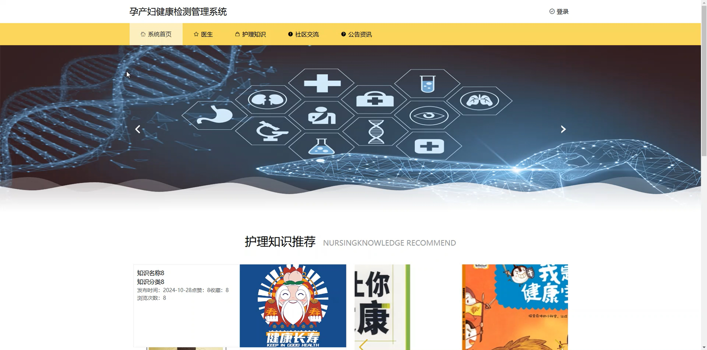
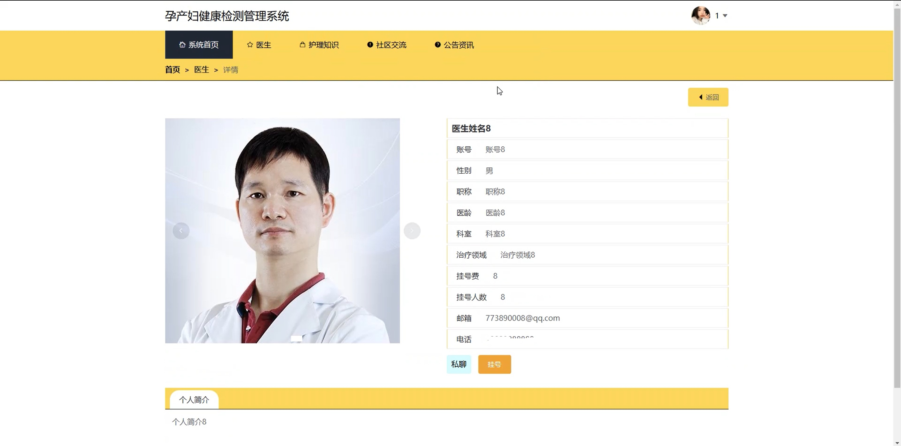
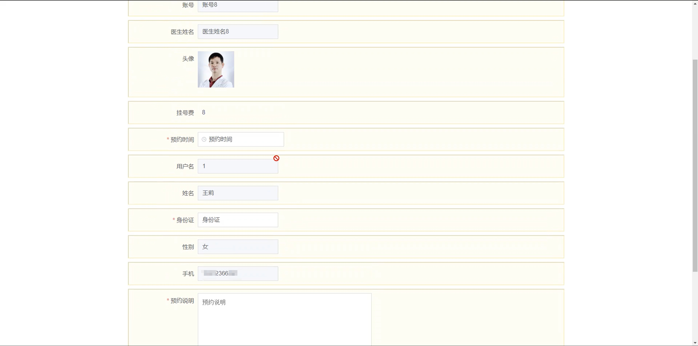
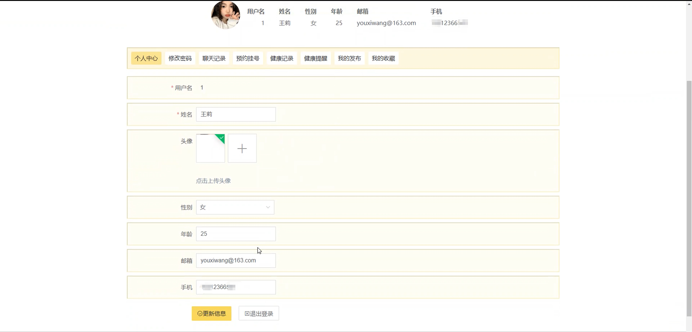
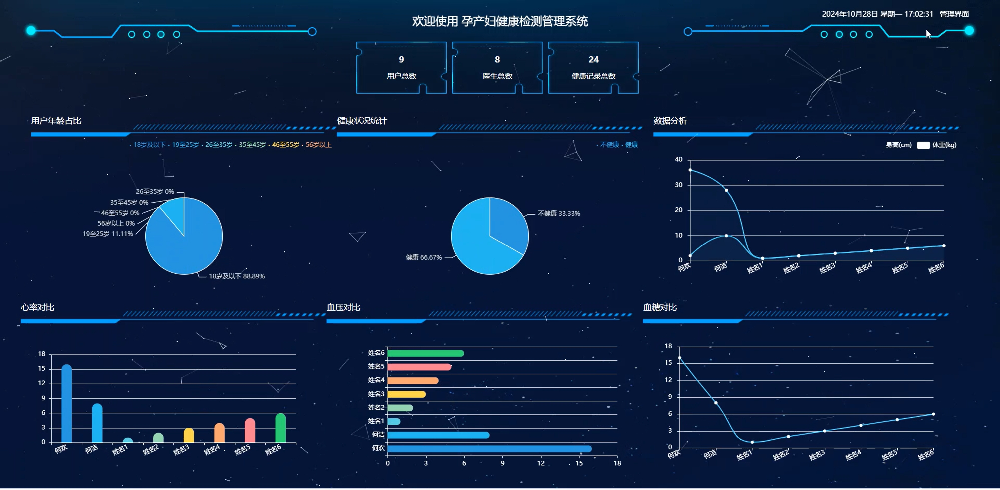
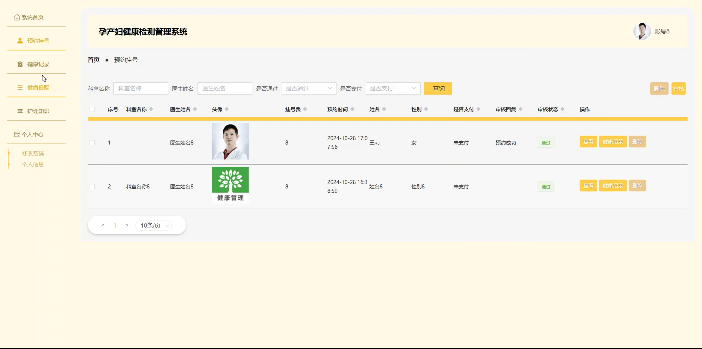
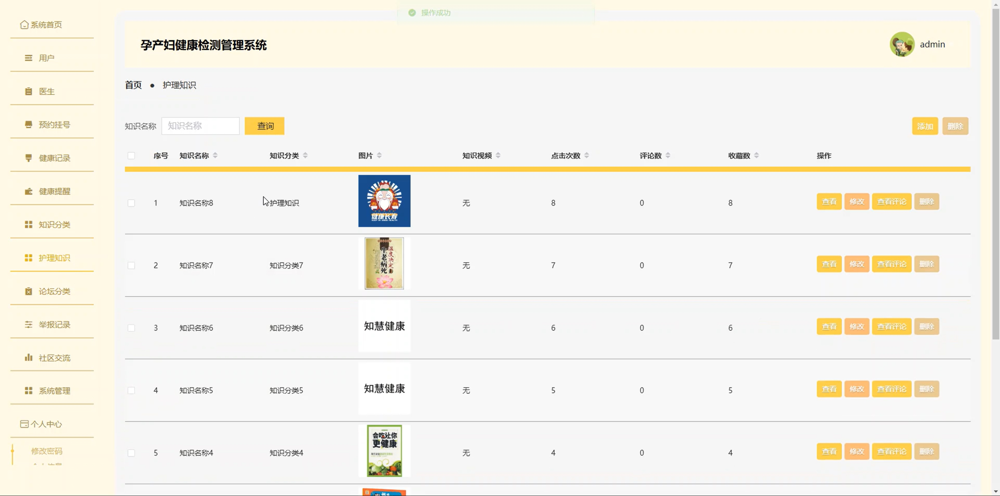
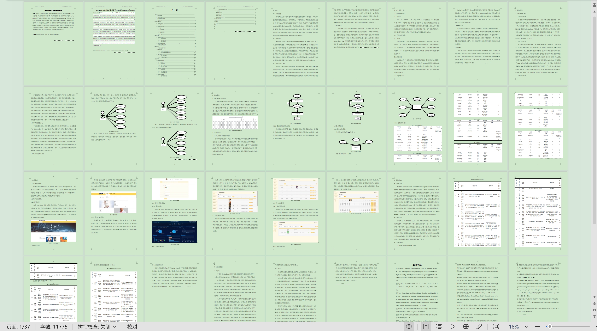

# springbootA519D
springbootA519D孕产妇健康检测管理系统+LW
## 查看主页获取源码

### 一、关键词
护理知识、预约挂号、健康记录

### 二、作品包含
源码+数据库+设计文档万字+全套环境和工具资源+本地部署教程

### 三、项目技术
前端技术：Html、Css、Js、Vue2.0、Element-ui 
后端技术：Java、SpringBoot2.0、MyBatis

### 四、运行环境（以下版本亲测，其他版本未知，请自测）
开发工具：IDEA/eclipse  + VSCODE

数据库：MySQL5.7（最低要5.7版本）

数据库管理工具：Navicat10以上版本

环境配置软件： JDK1.8 + Maven3.6.3

前端Nodejs：14

浏览器：谷歌浏览器

### 五、项目介绍
项目编号：springbootA519D

孕产妇健康检测管理系统可助力医护人员高效管理孕产妇健康数据等功能，为孕产妇健康监测与诊疗提供便捷数字化支持。

角色：管理员、用户、医生

管理员：系统首页、用户、医生、预约挂号、健康记录、健康提醒、知识分类、护理知识、论坛分类、举报记录、社区交流、系统管理、个人中心。

用户：系统首页、医生、护理知识、社区交流、公告资讯、个人中心、修改密码、聊天记录、预约挂号、健康记录、健康提醒、我的发布、我的收藏。

医生：系统首页、预约挂号、健康记录、健康提醒、护理知识、个人中心。

### 六、运行截图

